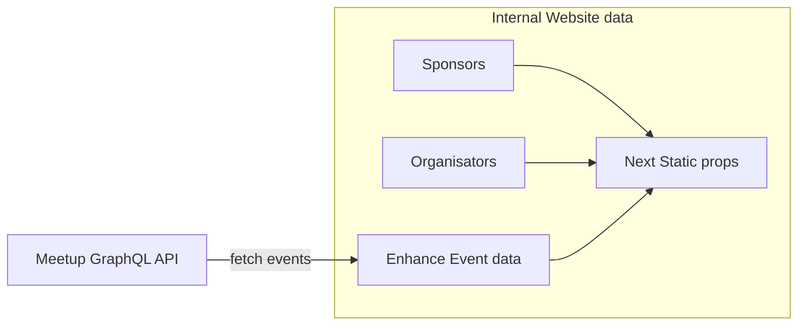
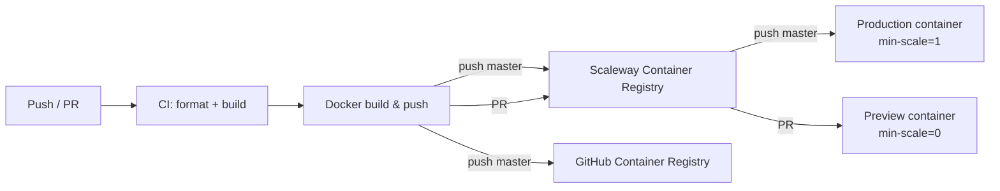

# How to contribute to the project?

## Install

Make sure to have installed:

- Node > 16
- Git
- Pnpm

```bash
git clone git@github.com:lyonjs/lyonjs.github.com.git

pnpm install
```

## Some useful commands

- `pnpm build`, build next output of the website and run eslint
- `pnpm fmt`, format all files with prettier
- `pnpm fmt:check`, check format all files with prettier
- `pnpm dev`, start a local dev server on port 3000
- `pnpm export`, export the website as static html file
- `pnpm e2e`, run e2e test with Playwright

## Husky git hooks

We use husky to install and handle git hooks on pre-commit to pre-run lint and format on files before even pushing them on github.
Normally, they should be installed with the first `pnpm install`

## Architecture of data used in the app



## Deployment

The site is deployed on **Scaleway Serverless Containers**. The CI pipeline (`.github/workflows/integration.yml`) handles everything automatically.

### How it works



- **Production** (`master`): the container is always warm (`min-scale=1`, `max-scale=5`). Deployed automatically on every push to `master`.
- **Preview** (pull requests): a `preview-pr-<N>` container is created per PR with scale-to-zero (`min-scale=0`). The preview URL appears in the PR via GitHub Environments ("View deployment" button). The container and image tag are automatically cleaned up when the PR is closed (`.github/workflows/deploy-cleanup.yml`).

### Docker image registries

Images are pushed to two registries:
- **Scaleway Container Registry** (`rg.fr-par.scw.cloud/lyonjs/lyonjs.github.com`) — used by Serverless Containers for deployment
- **GitHub Container Registry** (`ghcr.io/lyonjs/lyonjs.github.com`) — archive/backup, push on `master` only

### Environment variables

The `DEPLOY_ENV` variable (`production` or `preview`) controls whether CSP security headers are applied in `middleware.ts`.

### Required GitHub configuration

Secrets: `SCW_ACCESS_KEY`, `SCW_SECRET_KEY`, `SCW_DEFAULT_PROJECT_ID`, `SCW_DEFAULT_ORGANIZATION_ID`

Variables: `SCW_REGISTRY_ENDPOINT`, `SCW_PROD_NAMESPACE_ID`, `SCW_PREVIEW_NAMESPACE_ID`, `SCW_PROD_CONTAINER_ID`

## How to?

### How to enhance content of past events?

If you need to add sponsors, videos, descriptions, speakers to a passed or programmed event, you sadly have to add it manually in a file.
In [data-override.ts](./data/data-override.ts), you can override each _event_ by absolute url and override some informations.
