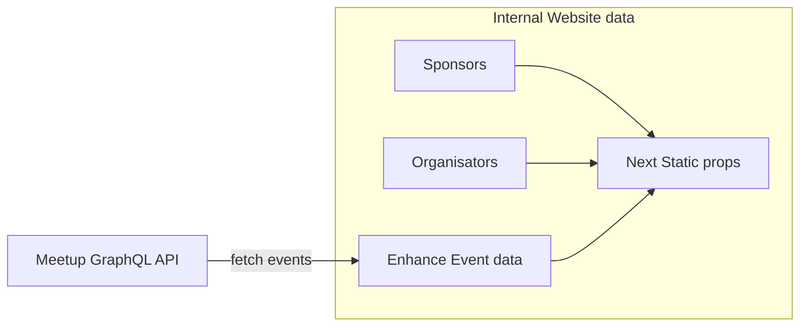

# How to contribute to the project?

## Install

Make sure to have installed:

- Node > 16
- Git
- Pnpm

```bash
git clone git@github.com:lyonjs/lyonjs.github.com.git

pnpm intall
```

## Some useful commands

- `pnpm build`, build next output of the website and run eslint
- `pnpm fmt`, format all files with prettier
- `pnpm fmt:check`, check format all files with prettier
- `pnpm dev`, start a local dev server on port 3000
- `pnpm export`, export the website as static html file
- `pnpm e2e`, run e2e test with Playwright

## Husky git hooks

We use husky to install and handle git hooks on pre-commit to pre-run lint and format on files before even pushing them on github.
Normally, they should be installed with the first `pnpm install`

## Architecture of data used in the app



## How to?

### How to enhance content of past events?

If you need to add sponsors, videos, descriptions, speakers to a passed or programmed event, you sadly have to add it manually in a file.
In [data-override.ts](./data/data-override.ts), you can override each _event_ by absolute url and override some informations.
